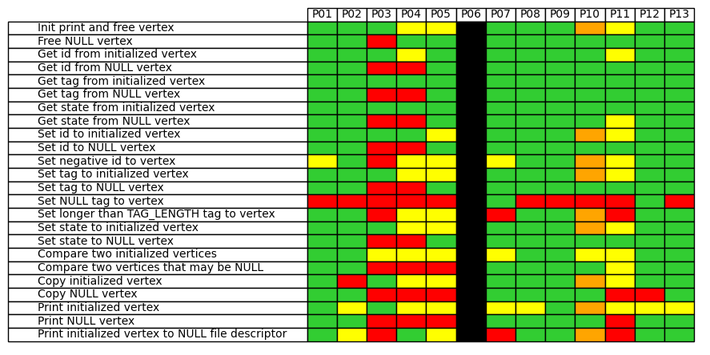

# ProgAutoEval

## Ejecución

Consiste en dos ficheros: AutoEval.py, que tiene toda la funcionalidad, y runAutoEval.py que ejecuta el programa. El comando para ejecutarlo sería:

> python runAutoEval.py -f <lista_de_ejercicios\>.csv -P 1

Siendo el argumento *obligatorio* '-f/--file' un fichero con los ejercicios a probar (ver sección de **Requisitos**) y el argumento *opcional* '-P/--plot' un booleano (0 == False, 1 == True) que indica si se quiere hacer una figura resumen (por defecto False).

Los ficheros de python deben colocarse en el mismo directorio en el que se encuentren las carpetas para cada entrega. Por ejemplo:

<pre>
--- P1/
   |--- AutoEval.py
   |--- runAutoEval.py
   |--- solution/
   |--- pareja1/
   |--- pareja2/
   |--- ...
   |--- parejaN/
</pre>

## Salida

El programa generará un resumen en texto plano y un informe detallado en formato *Markdown* para cada ejercicio en las carpetas de cada pareja. Estos informes pueden convertirse a PDF con el script:

> bash convert_md_to_pdf.sh

Además, si se selecciona la opción correspondiente, se generará una tabla resumen con los resultados de todas parejas para cada ejercicio, similar a la siguiente:

Donde cada color significa:
- **Verde**: correcto.
- **Negro**: error al compilar.
- **Morado**: error al enlazar.
- **Rojo**: error al ejecutar.
- **Naranja**: error de Valgrind.
- **Amarillo**: no se obtiene la salida esperada.

## Requisitos

### Python
Se necesita Python3 con **numpy**. Si se quiere hacer plots hace falta **matplotlib**.

### Solución
En el mismo directorio donde están las entregas de los estudiantes deberá existir una carpeta llamada **solution** con el código que se utilizará para generar las salidas correctas de cada ejericio.

### Lista de ejercicios

El fichero que se pasa como argumento tendrá la lista de ejercicios que se quieren probar, siguiendo el siguiente formato:

- **Tipo:** puede ser *main* o *library*, en función de si se quiere probar un main o una librería. **Obligatorio**.
- **Nombre:** nombre del ejercicio a probar. E.g. "p1_e1" **Obligatorio**.
- **Ficheros fuente:** lista separada por espacios. E.g. "node.c graph.c"
- **Directorios de librerías:** lista separada por espacios. E.g. "-L. -L/home"
- **Librerías:** lista separada por espacios. E.g. "-lm -lstack_fp"
- **Fichero main:** si se quiere probar un main indicar el fichero. E.g. "p1_e1.c"
- **Argumentos de entrada:** lista separada por espacios. E.g. "g1.txt 111 222"

Cada campo estará separado por comas. Un ejemplo de fichero sería el siguiente:
<pre>
type,exerciseName,sourceFiles,libDirs,libs,mainFile,inputArguments
library,node,node.c,,,,
main,p1_e1,node.c,,,p1_e1.c,
library,graph,node.c graph.c,,,,
main,p1_e2,graph.c,,,p1_e2.c,
main,p1_e3,node.c graph.c,,,p1_e3.c,g1.txt
</pre>

### Plantillas
En el caso de que la prueba sea de tipo **library** el programa buscará en su mismo directorio una plantilla con la que generar los distintos mains de pruebas a utilizar. Esta plantilla debe llamarse `template_<exerciseName>.txt`, donde *exerciseName* es el nombre del ejercicio a probar que figura en la lista de pruebas.

Estas plantillas deben seguir la siguiente estructura:

#### Cabecera
Las líneas de cabecera que sean comunes para todos los main se deben poner entre `@@@` como en el ejemplo:
<pre>
@@@
#include <stdio.h>
#include <stdlib.h>
#include "node.h"
@@@
</pre>

#### Bloques de código
Se pueden añadir tantos bloques de código como se quiera, precedidos por `$$$` y un número identificativo, y terminados de nuevo por `$$$`. Estos bloques serán los que se combinen para crear los distintos mains de pruebas. Por ejemplo:

<pre>
$$$ 0
Node * n1 = NULL, * n2 = NULL, *n3 = NULL;
$$$

$$$ 1
printf("\nTesting init with n1:\n");
n1 = node_init();

// Test getters
printf("\nTesting getters with n1 initialized:\n");

printf("getId n1: %ld\n", node_getId(n1));
printf("getName n1: %s\n", node_getName(n1));
printf("getNConnect n1: %d\n", node_getNConnect(n1));
printf("getLabel n1: %d\n", node_getLabel(n1));
$$$

$$$ 2
// NULL input
printf("\nTesting getters with n2 no initialized:\n");

printf("getId n2: %ld\n", node_getId(n2));
printf("getName n2: %s\n", node_getName(n2));
printf("getNConnect n2: %d\n", node_getNConnect(n2));
printf("getLabel n2: %d\n", node_getLabel(n2));
$$$

$$$ 3
//Free
printf("\nFree nodes\n");
node_free(n1);
node_free(n2);
node_free(n3);

return 0;
$$$
</pre>

#### Pruebas del ejercicio
Por último, se detallarán las diferentes pruebas para el ejercicio que se van a realizar, dando una descripción de ellas y los bloques que hay que utilizar (y en que orden) para generar el main correspondiente. Esta sección debe comenzar y terminar con `???`. Por ejemplo:

<pre>
???
Test getters with initialized node,0 1 8
Test getters with NULL node,0 2 8
???
</pre>

## Funcionamiento
El programa ejecutará todas las pruebas de la lista sobre cada entrega. En la carpeta correspondiente a cada entrega generará un informe en formato Markdown (.md) para cada ejercicio. En el se detallará el proceso de compilación, enlazado, ejecución, comparación de la salida (con respecto al código de **solution**) y ejecución de Valgrind para cada prueba del ejercicio.